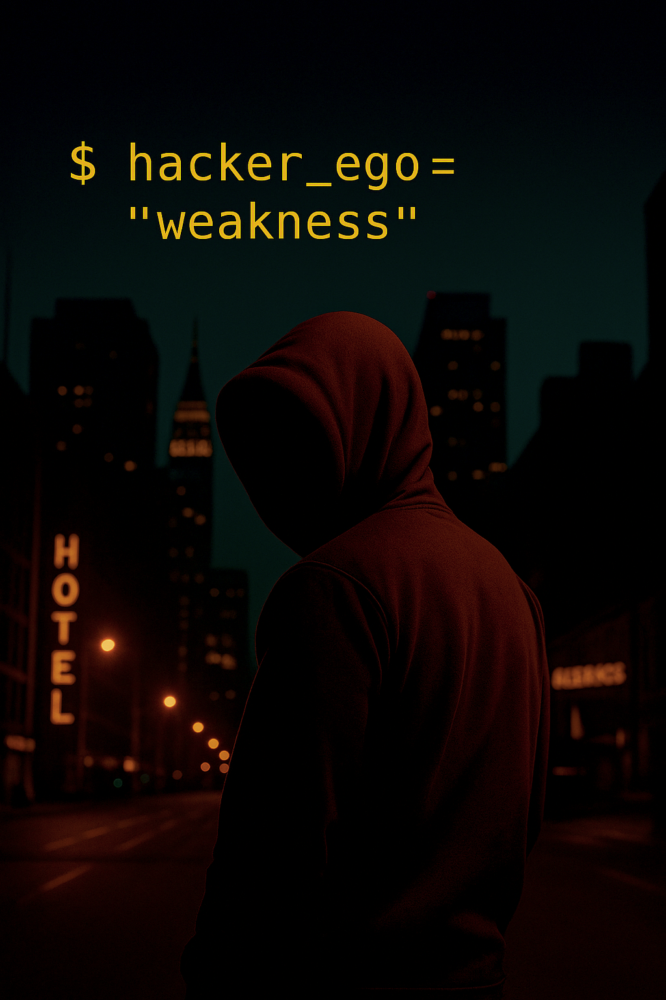

# Ego - A Hacker’s Greatest Weakness

Projet pédagogique en cybersécurité…

  

<em>© 2025 Virginie Lechene - Tous droits réservés</em> 
Reproduction interdite sans autorisation préalable. 
Usage pédagogique uniquement.

<em>Image protégée - Propriété exclusive</em>

----
<h2 align="center">EGO - La vraie faiblesse des hackers</h2>

Dans le domaine de la cybersécurité, on imagine souvent les hackers comme des fantômes impossibles à tracer.  
La réalité est beaucoup plus humaine : **leur ego les trahit**.

Ce document explique pourquoi *EGO* est un titre parfaitement pertinent - techniquement, psychologiquement et opérationnellement.  

---  

## Sommaire

- [EGO – La vraie faiblesse des hackers](#ego---la-vraie-faiblesse-des-hackers)
- [L’ego provoque des erreurs d’OpSec](#lego-provoque-des-erreurs-dopsec)
- [Comment les hackers restent (presque) invisibles en ligne](#comment-les-hackers-restent-presque-invisibles-en-ligne)
- [Pourquoi il est dangereux de donner la clé du routeur](#pourquoi-il-est-dangereux-de-donner-la-cle-du-routeur)
- [Pourquoi ne jamais donner cette clé à des personnes externes](#pourquoi-ne-jamais-donner-cette-cle-a-des-personnes-externes)
- [Pourquoi configurer un Wi-Fi « Invité »](#pourquoi-configurer-un-wi-fi-invite)
- [Le Wi-Fi : une ressource que les hackers adorent utiliser](#le-wi-fi--une-ressource-que-les-hackers-adorent-utiliser)
- [Comment le réseau invité protège l’entreprise](#comment-le-reseau-invite-protege-lentreprise)
- [Résumé](#resume)
- [Note essentielle : la sécurité repose sur zéro erreur](#note-essentielle--la-securite-repose-sur-zero-erreur)
- [Une seule défaillance compromet tout](#une-seule-defaillance-compromet-tout)
- [Sources et références (2024–2025)](#sources-et-references-20242025)

---

## ✅ L’ego provoque des erreurs d’OpSec   

La plupart des hackers ne sont pas attrapés par des technologies sophistiquées,     
➡️ **mais par leurs propres erreurs.**   

Ces erreurs sont souvent liées à l'ego :   

- réutilisation d'un même script préféré,     
- retour sur une machine déjà compromise,     
- oubli de nettoyer certains logs,     
- confiance excessive dans leur anonymat,     
- négligence des proxys et rebonds.      

Exemple typique      
$ attacker --reuse-tool exploit_v2.py         
➡️ Signature identique détectée dans plusieurs incidents   

                     ┏━━━━━━━━━━━━━━━━━━━━━━┓
                     ┃       PROFIL         ┃
                     ┃       Hacker         ┃
                     ┗━━━━━━━━━━━━━━━━━━━━━━┛
                               ↑
                               │
                               │
        ┏━━━━━━━━━━━━━━━━━━┓       ┏━━━━━━━━━━━━━━━━━━┓
        ┃   Le curieux     ┃  ←→   ┃   L’obsessif     ┃
        ┗━━━━━━━━━━━━━━━━━━┛       ┗━━━━━━━━━━━━━━━━━━┛
                               │
                               ↓
                     ┏━━━━━━━━━━━━━━━━━━┓
                     ┃  L’opportuniste  ┃
                     ┗━━━━━━━━━━━━━━━━━━┛
                               │
                               ↓
                     ┏━━━━━━━━━━━━━━━━━━┓
                     ┃   Le stratège    ┃
                     ┗━━━━━━━━━━━━━━━━━━┛
                               │
                               ↓
                     ┏━━━━━━━━━━━━━━━━━━┓
                     ┃  Le mercenaire   ┃
                     ┗━━━━━━━━━━━━━━━━━━┛

---   

# Comment les hackers restent (presque) invisibles en ligne   

On pense souvent que les hackers sont impossibles à retrouver.     
En réalité, ils laissent **toujours** des traces… mais tout est fait pour compliquer l'enquête.   

1️⃣ Ils n'utilisent presque jamais leur propre connexion      

Les attaquants expérimentés passent par :   

- le Wi-Fi de victimes,   
- des routeurs compromis,   
- des machines zombies (botnets),   
- des VPN en cascade,   
- TOR + proxys + multiples rebonds.   
➡️ L’adresse IP visible n’est **presque jamais la leur**.   

---   

2️⃣ Les traces existent, mais elles sont dispersées   

Une attaque peut passer par **5 à 10 pays**.     
Pour remonter l’origine, il faut :   

- récupérer les logs de chaque État,   
- obtenir des accords judiciaires internationaux,   
- compter sur une coopération réelle.   
➡️ En pratique : c’est souvent **trop lent** ou **inapplicable**.   

---   

3️⃣ Ils opèrent souvent depuis des pays ou ils risquent peu.  

Certains hackers agissent depuis des zones :   

- sans législation cyber claire,   
- où les autorités ne coopèrent pas,   
- contrôlées par des groupes criminels,   
- ou protégées par des États.   
➡️ Tant qu’ils restent dans ces pays, ils sont **difficiles à poursuivre**.    

---   

4️⃣ Le défenseur doit être parfait, l’attaquant non   

- Le défenseur doit surveiller **tout, en permanence**.   
- L’attaquant lui, n’a besoin que **d’une seule erreur** : service mal configuré, mot de passe réutilisé, employé distrait…   
➡️ L’attaquant a un **avantage structurel**.   

---   

5️⃣ L’ego pousse à commettre des erreurs   

Parce qu’ils se croient invisibles, certains hackers :   

- répètent les mêmes techniques,   
- reviennent sur les mêmes machines,   
- réutilisent leurs scripts favoris,   
- laissent des schémas comportementaux,   
- sous-estiment l’analyse forensique.   
➡️ Leur **excès de confiance** devient leur plus grande faiblesse.   

---   

> ⚠️ **NOTE IMPORTANTE**     
> Ne donne **jamais** la clé du routeur principal. C’est l’erreur la plus dangereuse et la plus fréquente dans les petites entreprises et à la maison.   

# Pourquoi il est dangereux de donner la clé du routeur   

Donner la clé Wi-Fi revient à **ouvrir l’accès au réseau interne**.     
Avec cette clé, un appareil peut :   

- se connecter au réseau principal,   
- atteindre les appareils internes,   
- intercepter certaines données,   
- installer ou propager des malwares,   
- provoquer des fuites ou des intrusions.   
➡️ Un simple téléphone infecté peut compromettre **tout le réseau**.    

---   

# Pourquoi ne jamais donner cette clé à des personnes externes   

Une personne externe peut involontairement introduire :   

- des virus ou des logiciels espions,   
- des malwares dormants,   
-  des outils d’intrusion.   
➡️ Ce n’est **pas la personne** le problème, c’est **l’état de son appareil**.   

---   

# Pourquoi configurer un Wi-Fi “Invité”   

Créer un réseau invité permet à toute personne externe d’accéder à Internet **sans toucher au réseau interne** :   

- accès limité à internet uniquement,   
- isolation complète des appareils internes,   
- réduction des risques,   
- confinement des incidents potentiels.   

---   

⚠️ Le Wi-Fi : une ressource que les hackers adorent exploiter   

S’ils accèdent à votre Wi-Fi, ils peuvent utiliser **votre connexion** pour :   

- attaquer d’autres entreprises,   
- envoyer des e-mails malveillants,    
- mener des activités illégales.   
➡️ Toutes ces actions apparaîtront comme venant de **votre adresse IP**.   

---   

# Comment le réseau invité protège l’entreprise   

Un Wi-Fi invité :   

- isole les appareils externes,   
- empêche les abus de connexion,   
- bloque la propagation de logiciels malveillants,   
- protège l’entreprise et la responsabilité du propriétaire du réseau.   

---

✅ Résumé   

- Donner la clé du routeur = **accès complet au réseau interne**.  
- Un appareil infecté peut **compromettre l’entreprise**.  
- Le Wi-Fi principal doit rester **strictement interne**.  
- Le Wi-Fi invité protège **les utilisateurs** et **l’entreprise**.

---

> 🛑 **Note essentielle : La sécurité repose sur l'absence totale d'erreur.**  
> Les attaquants ne cherchent pas la perfection. Ils cherchent la moindre **faille**.

# Une seule défaillance compromet tout.

Pour pénétrer un système, un hacker n’a besoin que de :

- 🔺 **Une vulnérabilité non corrigée**
- 🔺 **Un mot de passe faible ou réutilisé**
- 🔺 **Une seule erreur humaine**

Il suffit **d’un seul élément**…  
et la compromission est possible.

---

        ┌───────────────────────────────┐
        │          ATTAQUANT            │
         (n’utilise jamais sa propre IP)│
        └───────────────────────────────┘
                     │
                     v
        ┌───────────────────────────────┐
        │Wi-Fi compromis/Hotspot public │
        │ (café, voisin, victime, 
                 lieu ouvert)           │
        └───────────────────────────────┘
                     │
                     v
        ┌───────────────────────────────┐
        │        Routeur compromis      │
        │       (appareil utilisé 
                  comme relais)         │
        └───────────────────────────────┘
                     │
                     v
        ┌───────────────────────────────┐
        │       Machine zombie          │
        │      (PC infecté / botnet)    │
        └───────────────────────────────┘
                     │
                     v
        ┌───────────────────────────────┐
        │          VPN #1               │
        │       (premier rebond)        │
        └───────────────────────────────┘
                     │
                     v
        ┌───────────────────────────────┐
        │           VPN #2              │
        │ (cascade / changement de pays)│
        └───────────────────────────────┘
                     │
                     v
        ┌───────────────────────────────┐
        │            TOR                │
        │    (multi-rebonds anonymes)   │
        └───────────────────────────────┘
                     │
                     v
        ┌───────────────────────────────┐
        │       Chaîne de proxys        │
        │(multiples relais additionnels)│
        └───────────────────────────────┘
                     │
                     v
        ┌───────────────────────────────┐
        │       SERVEUR CIBLE           │
        │    (entreprise / site attaqué)│
        └───────────────────────────────┘

        ---

🛑 Le meilleur hacker n’est pas celui qui attaque, mais celui qu’on ne détecte jamais.

----

✍️ Auteur : *Virginie Lechene*

---

## Licence
Le script est publié sous la licence MIT.

## À propos de l’usage
Ce projet est destiné exclusivement à des fins pédagogiques, notamment dans le cadre de :
- d’une formation en cybersécurité,
- de tests d’intrusion légaux (pentest),
- d’analyses réseau dans un environnement contrôlé.

⚠️ L’auteure ne cautionne ni n’autorise l’utilisation de ce script en dehors d’un cadre légal strictement défini.
Toute utilisation non conforme est interdite et relève uniquement de la responsabilité de l’utilisateur.

## Droits sur les visuels
Les visuels, illustrations ou captures présents dans ce dépôt sont la propriété exclusive de l’auteure.
Toute reproduction ou utilisation non autorisée est interdite.

