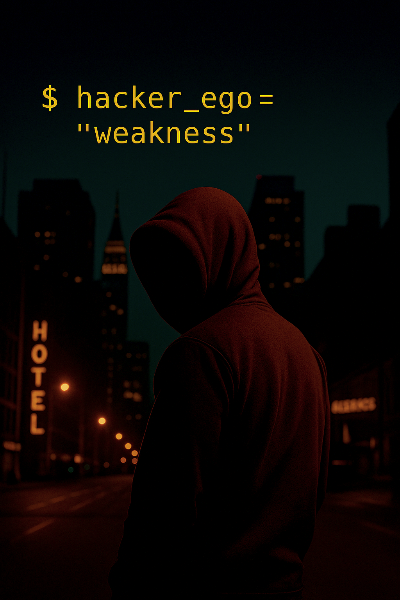

  

<em>© 2025 Virginie Lechene 
.

 

----
<h2 align="center">EGO - La vraie faiblesse des hackers</h2>

Dans le domaine de la cybersécurité, on imagine souvent les hackers comme des fantômes impossibles à tracer.  
La réalité est beaucoup plus humaine : **leur ego les trahit**.

Ce document explique pourquoi *EGO* est un titre parfaitement pertinent - techniquement, psychologiquement et opérationnellement.  

---  

## Sommaire

- [EGO – La vraie faiblesse des hackers](#ego---la-vraie-faiblesse-des-hackers)
- [L’ego provoque des erreurs d’OpSec](#lego-provoque-des-erreurs-dopsec)
- [Comment les hackers restent (presque) invisibles en ligne](#comment-les-hackers-restent-presque-invisibles-en-ligne)
- [Pourquoi il est dangereux de donner la clé du routeur](#pourquoi-il-est-dangereux-de-donner-la-cle-du-routeur)
- [Pourquoi ne jamais donner cette clé à des personnes externes](#pourquoi-ne-jamais-donner-cette-cle-a-des-personnes-externes)
- [Pourquoi configurer un Wi-Fi « Invité »](#pourquoi-configurer-un-wi-fi-invite)
- [Le Wi-Fi : une ressource que les hackers adorent utiliser](#le-wi-fi--une-ressource-que-les-hackers-adorent-utiliser)
- [Comment le réseau invité protège l’entreprise](#comment-le-reseau-invite-protege-lentreprise)
- [Résumé](#resume)
- [Note essentielle : la sécurité repose sur zéro erreur](#note-essentielle--la-securite-repose-sur-zero-erreur)
- [Une seule défaillance compromet tout](#une-seule-defaillance-compromet-tout)
- [Sources et références (2024–2025)](#sources-et-references-20242025)

---

## 🔐 MICE - Pourquoi parler d’EGO ?

Le modèle **MICE** décrit les motivations humaines :
- **Money** (argent)
- **Ideology** (idéologie)
- **Compromise** (compromission)
- **Ego**

Je mets l’accent sur **EGO**, car c’est la faiblesse la plus visible : l’ego pousse à se mettre en avant, à prendre des risques et finit par briser l’OpSec. C’est souvent ce qui trahit les hackers.

> **OpSec (Operational Security)** : ensemble de pratiques techniques et comportementales qui visent à limiter au maximum les fuites d’informations et à empêcher un adversaire de comprendre qui vous êtes, ce que vous faites et comment vous le faites.

---

## ✅ L’ego provoque des erreurs d’OpSec

➡️ Malgré l’emploi de techniques d’anonymisation, un attaquant peut laisser des indices en :

- réutilisant un outil, un pseudonyme ou une infrastructure ;
- se reconnectant à un système déjà surveillé ;
- mélangeant ses identités personnelles et opérationnelles ;
- conservant des habitudes techniques ou horaires reconnaissables ;
- révélant accidentellement une adresse IP ou des métadonnées.

Ces éléments ne permettent pas toujours d’identifier une personne. Leur recoupement entre plusieurs incidents peut toutefois aider les enquêteurs à relier différentes opérations à un même acteur.

L’excès de confiance peut favoriser certaines erreurs, mais il n’en est pas l’unique cause.

                     ┏━━━━━━━━━━━━━━━━━━━━━━┓
                     ┃       PROFIL         ┃
                     ┃       Hacker         ┃
                     ┗━━━━━━━━━━━━━━━━━━━━━━┛
                               ↑
                               │
                               │
        ┏━━━━━━━━━━━━━━━━━━┓       ┏━━━━━━━━━━━━━━━━━━┓
        ┃   Le curieux     ┃  ←→   ┃   L’obsessif     ┃
        ┗━━━━━━━━━━━━━━━━━━┛       ┗━━━━━━━━━━━━━━━━━━┛
                               │
                               ↓
                     ┏━━━━━━━━━━━━━━━━━━┓
                     ┃  L’opportuniste  ┃
                     ┗━━━━━━━━━━━━━━━━━━┛
                               │
                               ↓
                     ┏━━━━━━━━━━━━━━━━━━┓
                     ┃   Le stratège    ┃
                     ┗━━━━━━━━━━━━━━━━━━┛
                               │
                               ↓
                     ┏━━━━━━━━━━━━━━━━━━┓
                     ┃  Le mercenaire   ┃
                     ┗━━━━━━━━━━━━━━━━━━┛

---   

# Comment les hackers restent (presque) invisibles en ligne   

## Comment certains attaquants dissimulent leur origine en ligne

Les attaquants peuvent utiliser différents intermédiaires afin de compliquer leur identification. Ces méthodes ne les rendent toutefois pas invisibles et peuvent laisser des traces exploitables.

### 1️⃣ L’adresse IP observée n’est pas nécessairement celle de l’attaquant

Une connexion malveillante peut notamment transiter par :

- un appareil ou un routeur compromis ;
- une machine appartenant à un botnet ;
- un VPN ou un proxy ;
- le réseau Tor ;
- plusieurs infrastructures intermédiaires.

➡️ L’adresse IP visible peut donc appartenir à un intermédiaire. Elle reste néanmoins un indice utile pour l’enquête.

---   

### 2️⃣ Les traces peuvent être réparties entre plusieurs services et juridictions

Lorsqu’une connexion passe par plusieurs intermédiaires, les informations utiles peuvent être détenues par différents fournisseurs de VPN, opérateurs, hébergeurs ou services en ligne, parfois situés dans plusieurs pays.

Pour tenter de reconstituer le parcours, les enquêteurs peuvent devoir :

- identifier les intermédiaires concernés ;
- obtenir et comparer des journaux de connexion horodatés ;
- adresser des demandes légales aux entreprises ou aux autorités compétentes ;
- agir avant l’expiration ou la suppression des données.

➡️ La conservation limitée des journaux, le chiffrement, l’absence de données et les délais de coopération peuvent compliquer ou empêcher la remontée jusqu’à l’origine.

---   

### 3️⃣ Le pays depuis lequel un attaquant opère peut compliquer les poursuites

La localisation réelle d’un attaquant et celle des infrastructures utilisées peuvent relever de juridictions différentes.

Une enquête peut devenir plus difficile lorsque :

- les autorités doivent transmettre une demande d’entraide internationale ;
- les lois, les procédures ou les délais de conservation des données diffèrent ;
- les fournisseurs concernés ne disposent plus des journaux nécessaires ;
- la coopération entre les pays est limitée ou lente ;
- l’auteur bénéficie d’une protection ou d’une tolérance locale.

➡️ La localisation à l’étranger ne garantit pas l’impunité, mais elle peut ralentir ou compliquer l’identification, l’arrestation et l’extradition d’un suspect.

---   

### 4️⃣ La défense et l’attaque sont asymétriques

Une organisation doit protéger de nombreux comptes, appareils et services. Un attaquant cherche seulement un point d’entrée exploitable : service mal configuré, mot de passe compromis, logiciel non corrigé ou erreur humaine.

Cette asymétrie peut avantager l’attaquant, mais le défenseur n’a pas besoin d’être parfait. La segmentation, l’authentification multifacteur, la surveillance et la réponse aux incidents peuvent empêcher une première intrusion de compromettre tout le système.

---

### 5️⃣ La répétition de certaines habitudes peut faciliter l’attribution

Certains attaquants peuvent :

- réutiliser les mêmes outils, pseudonymes ou infrastructures ;
- reproduire des techniques et des configurations particulières ;
- revenir sur des systèmes déjà surveillés ;
- conserver des habitudes techniques ou horaires reconnaissables ;
- sous-estimer les capacités d’analyse et de recoupement.

➡️ Ces ressemblances constituent des indices. Elles ne prouvent pas, à elles seules, que plusieurs opérations ont été menées par la même personne.

L’excès de confiance peut favoriser ces erreurs, mais il n’en est pas nécessairement la cause.

4️⃣ Le défenseur doit être parfait, l’attaquant non   

- Le défenseur doit surveiller **tout, en permanence**.   
- L’attaquant lui, n’a besoin que **d’une seule erreur** : service mal configuré, mot de passe réutilisé, employé distrait…   
➡️ L’attaquant a un **avantage structurel**.   

---   

5️⃣ L’ego pousse à commettre des erreurs   

Parce qu’ils se croient invisibles, certains hackers :   

- répètent les mêmes techniques,   
- reviennent sur les mêmes machines,   
- réutilisent leurs scripts favoris,   
- laissent des schémas comportementaux,   
- sous-estiment l’analyse forensique.   
➡️ Leur **excès de confiance** devient leur plus grande faiblesse.   

---   

> ⚠️ **NOTE IMPORTANTE**     
> Ne donne **jamais** la clé du routeur principal. C’est l’erreur la plus dangereuse et la plus fréquente dans les petites entreprises et à la maison.   

# Pourquoi il est dangereux de donner la clé du routeur   

Donner la clé Wi-Fi revient à **ouvrir l’accès au réseau interne**.     
Avec cette clé, un appareil peut :   

- se connecter au réseau principal,   
- atteindre les appareils internes,   
- intercepter certaines données,   
- installer ou propager des malwares,   
- provoquer des fuites ou des intrusions.   
➡️ Un simple téléphone infecté peut compromettre **tout le réseau**.    

---   

# Pourquoi ne jamais donner cette clé à des personnes externes   

Une personne externe peut involontairement introduire :   

- des virus ou des logiciels espions,   
- des malwares dormants,   
-  des outils d’intrusion.   
➡️ Ce n’est **pas la personne** le problème, c’est **l’état de son appareil**.   

---   

# Pourquoi configurer un Wi-Fi “Invité”   

Créer un réseau invité permet à toute personne externe d’accéder à Internet **sans toucher au réseau interne** :   

- accès limité à internet uniquement,   
- isolation complète des appareils internes,   
- réduction des risques,   
- confinement des incidents potentiels.   

---   

⚠️ Le Wi-Fi : une ressource que les hackers adorent exploiter   

S’ils accèdent à votre Wi-Fi, ils peuvent utiliser **votre connexion** pour :   

- attaquer d’autres entreprises,   
- envoyer des e-mails malveillants,    
- mener des activités illégales.   
➡️ Toutes ces actions apparaîtront comme venant de **votre adresse IP**.   

---   

# Comment le réseau invité protège l’entreprise   

Un Wi-Fi invité :   

- isole les appareils externes,   
- empêche les abus de connexion,   
- bloque la propagation de logiciels malveillants,   
- protège l’entreprise et la responsabilité du propriétaire du réseau.   

---

✅ Résumé   

- Donner la clé du routeur = **accès complet au réseau interne**.  
- Un appareil infecté peut **compromettre l’entreprise**.  
- Le Wi-Fi principal doit rester **strictement interne**.  
- Le Wi-Fi invité protège **les utilisateurs** et **l’entreprise**.

---

> 🛑 **Note essentielle : La sécurité repose sur l'absence totale d'erreur.**  
> Les attaquants ne cherchent pas la perfection. Ils cherchent la moindre **faille**.

# Une seule défaillance compromet tout.

Pour pénétrer un système, un hacker n’a besoin que de :

- 🔺 **Une vulnérabilité non corrigée**
- 🔺 **Un mot de passe faible ou réutilisé**
- 🔺 **Une seule erreur humaine**

Il suffit **d’un seul élément**…  
et la compromission est possible.

---

        ┌───────────────────────────────┐
        │          ATTAQUANT            │
         (n’utilise jamais sa propre IP)│
        └───────────────────────────────┘
                     │
                     v
        ┌───────────────────────────────┐
        │Wi-Fi compromis/Hotspot public │
        │ (café, voisin, victime, 
                 lieu ouvert)           │
        └───────────────────────────────┘
                     │
                     v
        ┌───────────────────────────────┐
        │        Routeur compromis      │
        │       (appareil utilisé 
                  comme relais)         │
        └───────────────────────────────┘
                     │
                     v
        ┌───────────────────────────────┐
        │       Machine zombie          │
        │      (PC infecté / botnet)    │
        └───────────────────────────────┘
                     │
                     v
        ┌───────────────────────────────┐
        │          VPN #1               │
        │       (premier rebond)        │
        └───────────────────────────────┘
                     │
                     v
        ┌───────────────────────────────┐
        │           VPN #2              │
        │ (cascade / changement de pays)│
        └───────────────────────────────┘
                     │
                     v
        ┌───────────────────────────────┐
        │            TOR                │
        │    (multi-rebonds anonymes)   │
        └───────────────────────────────┘
                     │
                     v
        ┌───────────────────────────────┐
        │       Chaîne de proxys        │
        │(multiples relais additionnels)│
        └───────────────────────────────┘
                     │
                     v
        ┌───────────────────────────────┐
        │       SERVEUR CIBLE           │
        │    (entreprise / site attaqué)│
        └───────────────────────────────┘

        ---

🛑 Le meilleur hacker n’est pas celui qui attaque, mais celui qu’on ne détecte jamais.

----

✍️ Auteur : *Virginie Lechene*

---

## Licence
Le script est publié sous la licence MIT.

## À propos de l’usage
Ce projet est destiné exclusivement à des fins pédagogiques, notamment dans le cadre de :
- d’une formation en cybersécurité,
- de tests d’intrusion légaux (pentest),
- d’analyses réseau dans un environnement contrôlé.

⚠️ L’auteure ne cautionne ni n’autorise l’utilisation de ce script en dehors d’un cadre légal strictement défini.
Toute utilisation non conforme est interdite et relève uniquement de la responsabilité de l’utilisateur.

## 📷 Droits sur les visuels

Les visuels de ce dépôt sont protégés par la licence CC BY-ND 4.0.
Attribution obligatoire – Modification interdite.

© 2026 Virginie Lechene

